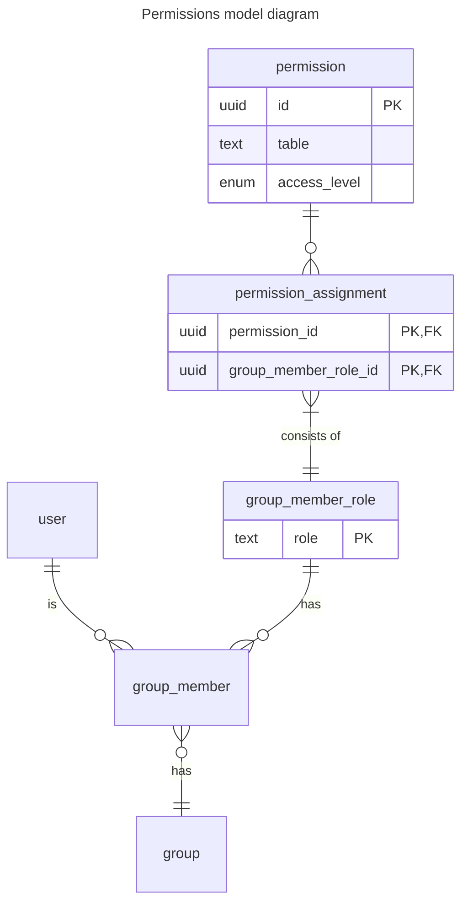
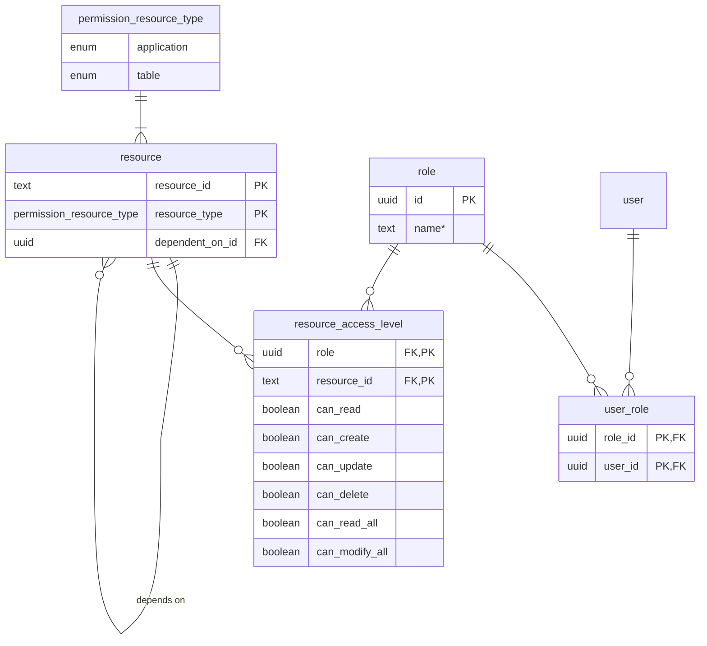

This is a [Next.js](https://nextjs.org) project bootstrapped with [`create-next-app`](https://nextjs.org/docs/app/api-reference/cli/create-next-app).

## Getting Started

First, run the development server:

```bash
npm run dev
# or
yarn dev
# or
pnpm dev
# or
bun dev
```

Open [http://localhost:3000](http://localhost:3000) with your browser to see the result.

You can start editing the page by modifying `app/page.tsx`. The page auto-updates as you edit the file.

This project uses [`next/font`](https://nextjs.org/docs/app/building-your-application/optimizing/fonts) to automatically optimize and load [Geist](https://vercel.com/font), a new font family for Vercel.

## Learn More

To learn more about Next.js, take a look at the following resources:

-   [Next.js Documentation](https://nextjs.org/docs) - learn about Next.js features and API.
-   [Learn Next.js](https://nextjs.org/learn) - an interactive Next.js tutorial.

You can check out [the Next.js GitHub repository](https://github.com/vercel/next.js) - your feedback and contributions are welcome!

## Deploy on Vercel

The easiest way to deploy your Next.js app is to use the [Vercel Platform](https://vercel.com/new?utm_medium=default-template&filter=next.js&utm_source=create-next-app&utm_campaign=create-next-app-readme) from the creators of Next.js.

Check out our [Next.js deployment documentation](https://nextjs.org/docs/app/building-your-application/deploying) for more details.

# Permissions model

Permissions are handled in the `permissions` schema in Supabase. The main mental model is that a user is assigned a permission set, that consists of application (schema) access permission (`viewer`, `editor`, `admin`) and table access permission containing Row-Level-Security (`read`, `create`, `update`, `delete`) and Column-Level-Access (`read`, `edit`).

> **RLS takes precedence over CLS**



Permissions are only valid within a group.



## Row-Level Security

Each record has an `owner_id` set by the person that created and owns the record. Read, update and delete operations require the `owner_id` to match `auth.userId()`.

Further access is granted with use of membership records. These specify a certain membership of a user within something. For example: a user can be a member of a group by having a group_member record with `group_id` and `user_id`.

A user can also read all records if their resource_access_level has `can_read_all` permission.

A user can also update and delete all records if their resource_access_level has `can_modify_all` permission.

## Table-Level Security

Table-level access will be handled based on permission sets and their assignments. Each user will receive a role

1. User is an editor in trip-planner
2. User is an editor in a group
3. User is an editor in a trip

## Security layers

### 1. Application

Layer deg=f
