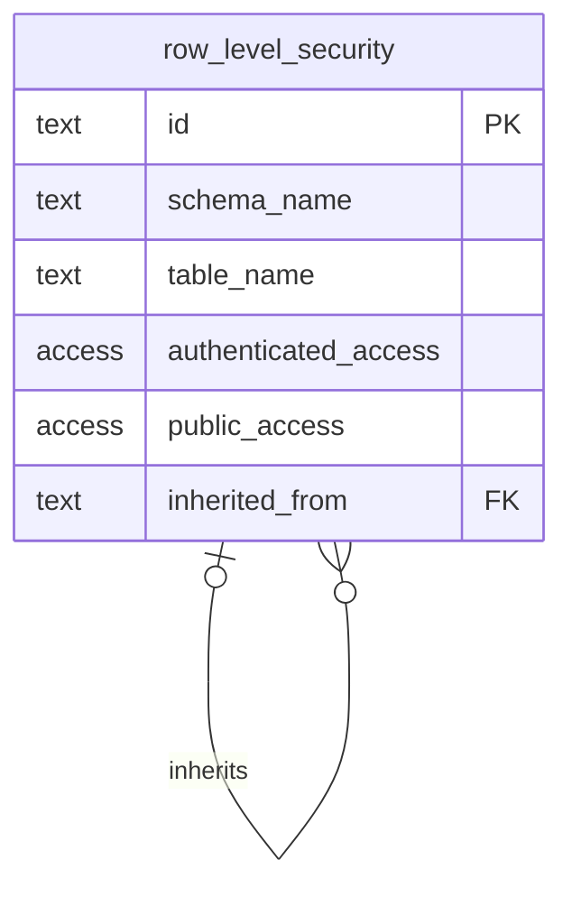

This is a [Next.js](https://nextjs.org) project bootstrapped with [`create-next-app`](https://nextjs.org/docs/app/api-reference/cli/create-next-app).

## Getting Started

First, run the development server:

```bash
npm run dev
# or
yarn dev
# or
pnpm dev
# or
bun dev
```

Open [http://localhost:3000](http://localhost:3000) with your browser to see the result.

You can start editing the page by modifying `app/page.tsx`. The page auto-updates as you edit the file.

This project uses [`next/font`](https://nextjs.org/docs/app/building-your-application/optimizing/fonts) to automatically optimize and load [Geist](https://vercel.com/font), a new font family for Vercel.

## Learn More

To learn more about Next.js, take a look at the following resources:

-   [Next.js Documentation](https://nextjs.org/docs) - learn about Next.js features and API.
-   [Learn Next.js](https://nextjs.org/learn) - an interactive Next.js tutorial.

You can check out [the Next.js GitHub repository](https://github.com/vercel/next.js) - your feedback and contributions are welcome!

## Deploy on Vercel

The easiest way to deploy your Next.js app is to use the [Vercel Platform](https://vercel.com/new?utm_medium=default-template&filter=next.js&utm_source=create-next-app&utm_campaign=create-next-app-readme) from the creators of Next.js.

Check out our [Next.js deployment documentation](https://nextjs.org/docs/app/building-your-application/deploying) for more details.

# Permissions model

Permissions are handled in the `permissions` schema in Supabase. The main mental model is that a user is assigned a permission set, that consists of application (schema) access permission (`viewer`, `editor`, `admin`) and table access permission containing Row-Level-Security (`read`, `create`, `update`, `delete`) and Column-Level-Access (`read`, `edit`).

## Row level security

Row level security is a single row specifying the access for a table. The access can be: `private`, `public/read`, `public/modify`, `inherited`, `none`. The row-level security table looks as following:



If the access is set to private, it is granted based on owner_id field on a given table. A constraint is given on `unique (schema_name, table_name)` as these two generate the `id`. Moreover, a table specified must exist within a database.

The table is created as:

```sql
-- ============================================================
-- permissions schema
-- ============================================================

CREATE SCHEMA IF NOT EXISTS permissions;

-- ------------------------------------------------------------
-- Enums
-- ------------------------------------------------------------

CREATE TYPE permissions.row_level_access AS ENUM (
    'private',
    'public/read',
    'public/modify',
    'membership',
    'inherited',
    'none'
);

-- ------------------------------------------------------------
-- Core table
-- ------------------------------------------------------------
create table permissions.row_level_security (
  id text GENERATED ALWAYS as (((schema_name || '.'::text) || table_name)) STORED not null,
  schema_name text not null default 'public'::text,
  table_name text not null,
  authenticated_access permissions.row_level_access not null default 'none'::permissions.row_level_access,
  public_access permissions.row_level_access not null default 'none'::permissions.row_level_access,
  owner_column text null,
  membership_table text null,
  membership_fk text null,
  membership_pk text null,
  membership_user_fk text null,
  inherited_from text null,
  inherited_fk text null,
  inherited_pk text null,
  constraint row_level_security_pkey primary key (id),
  constraint table_identifier unique (schema_name, table_name),
  constraint row_level_security_inherited_from_fkey foreign KEY (inherited_from) references permissions.row_level_security (id) on delete RESTRICT,
  constraint inherited_requires_from check (
    (
      (
        authenticated_access <> 'inherited'::permissions.row_level_access
      )
      or (inherited_from is not null)
    )
  ),
  constraint membership_requires_columns check (
    (
      (
        authenticated_access <> 'membership'::permissions.row_level_access
      )
      or (
        (membership_table is not null)
        and (membership_fk is not null)
        and (membership_user_fk is not null)
      )
    )
  ),
  constraint private_requires_owner check (
    (
      (
        authenticated_access <> 'private'::permissions.row_level_access
      )
      or (owner_column is not null)
    )
  )
) TABLESPACE pg_default;

create trigger trg_row_level_security_check_table BEFORE INSERT
or
update OF schema_name,
table_name,
owner_column,
membership_table,
membership_fk,
membership_user_fk,
inherited_from,
inherited_fk on permissions.row_level_security for EACH row
execute FUNCTION permissions.check_table_exists ();

-- ------------------------------------------------------------
-- Validation + auto-population trigger function
-- ------------------------------------------------------------

CREATE OR REPLACE FUNCTION permissions.check_table_exists()
RETURNS trigger
LANGUAGE plpgsql
SECURITY DEFINER
AS $$
DECLARE
  v_current_id     text;
  v_visited        text[];
  v_inherited_fk   text;
  v_inherited_pk   text;
  v_membership_pk  text;
  v_parent_schema  text;
  v_parent_table   text;
BEGIN

  -- ----------------------------------------------------------
  -- 1. Primary table must exist
  -- ----------------------------------------------------------
  IF NOT EXISTS (
    SELECT 1 FROM information_schema.tables t
    WHERE t.table_schema = NEW.schema_name
      AND t.table_name   = NEW.table_name
      AND t.table_type   = 'BASE TABLE'
  ) THEN
    RAISE EXCEPTION 'Table %.% does not exist',
      NEW.schema_name, NEW.table_name
      USING ERRCODE = 'foreign_key_violation';
  END IF;

  -- ----------------------------------------------------------
  -- 2. owner_column validation
  -- ----------------------------------------------------------
  IF NEW.owner_column IS NOT NULL THEN

    IF NOT EXISTS (
      SELECT 1 FROM information_schema.columns c
      WHERE c.table_schema = NEW.schema_name
        AND c.table_name   = NEW.table_name
        AND c.column_name  = NEW.owner_column
    ) THEN
      RAISE EXCEPTION 'Owner column % does not exist on %.%',
        NEW.owner_column, NEW.schema_name, NEW.table_name
        USING ERRCODE = 'foreign_key_violation';
    END IF;

    IF NOT EXISTS (
      SELECT 1
      FROM information_schema.referential_constraints rc
      JOIN information_schema.key_column_usage kcu_fk
        ON  kcu_fk.constraint_name   = rc.constraint_name
        AND kcu_fk.constraint_schema = rc.constraint_schema
      JOIN information_schema.key_column_usage kcu_pk
        ON  kcu_pk.constraint_name   = rc.unique_constraint_name
        AND kcu_pk.constraint_schema = rc.unique_constraint_schema
      WHERE kcu_fk.table_schema = NEW.schema_name
        AND kcu_fk.table_name   = NEW.table_name
        AND kcu_fk.column_name  = NEW.owner_column
        AND kcu_pk.table_schema = 'auth'
        AND kcu_pk.table_name   = 'users'
    ) THEN
      RAISE EXCEPTION 'Owner column % on %.% does not reference auth.users',
        NEW.owner_column, NEW.schema_name, NEW.table_name
        USING ERRCODE = 'foreign_key_violation';
    END IF;

  END IF;

  -- ----------------------------------------------------------
  -- 3. membership_* validation + auto-populate membership_pk
  -- ----------------------------------------------------------
  IF NEW.membership_table IS NOT NULL THEN

    IF NOT EXISTS (
      SELECT 1 FROM information_schema.tables t
      WHERE t.table_schema = NEW.schema_name
        AND t.table_name   = NEW.membership_table
        AND t.table_type   = 'BASE TABLE'
    ) THEN
      RAISE EXCEPTION 'Membership table %.% does not exist',
        NEW.schema_name, NEW.membership_table
        USING ERRCODE = 'foreign_key_violation';
    END IF;

    IF NOT EXISTS (
      SELECT 1 FROM information_schema.columns c
      WHERE c.table_schema = NEW.schema_name
        AND c.table_name   = NEW.membership_table
        AND c.column_name  = NEW.membership_fk
    ) THEN
      RAISE EXCEPTION 'Column % does not exist on %.%',
        NEW.membership_fk, NEW.schema_name, NEW.membership_table
        USING ERRCODE = 'foreign_key_violation';
    END IF;

    IF NOT EXISTS (
      SELECT 1 FROM information_schema.columns c
      WHERE c.table_schema = NEW.schema_name
        AND c.table_name   = NEW.membership_table
        AND c.column_name  = NEW.membership_user_fk
    ) THEN
      RAISE EXCEPTION 'Column % does not exist on %.%',
        NEW.membership_user_fk, NEW.schema_name, NEW.membership_table
        USING ERRCODE = 'foreign_key_violation';
    END IF;

    -- Validate membership_fk references target table and resolve membership_pk
    SELECT kcu_pk.column_name INTO v_membership_pk
    FROM information_schema.referential_constraints rc
    JOIN information_schema.key_column_usage kcu_fk
      ON  kcu_fk.constraint_name   = rc.constraint_name
      AND kcu_fk.constraint_schema = rc.constraint_schema
    JOIN information_schema.key_column_usage kcu_pk
      ON  kcu_pk.constraint_name   = rc.unique_constraint_name
      AND kcu_pk.constraint_schema = rc.unique_constraint_schema
    WHERE kcu_fk.table_schema = NEW.schema_name
      AND kcu_fk.table_name   = NEW.membership_table
      AND kcu_fk.column_name  = NEW.membership_fk
      AND kcu_pk.table_schema = NEW.schema_name
      AND kcu_pk.table_name   = NEW.table_name;

    IF v_membership_pk IS NULL THEN
      RAISE EXCEPTION 'Column % on %.% does not reference %.%',
        NEW.membership_fk, NEW.schema_name, NEW.membership_table,
        NEW.schema_name, NEW.table_name
        USING ERRCODE = 'foreign_key_violation';
    END IF;

    NEW.membership_pk := v_membership_pk;

    -- Validate membership_user_fk references auth.users
    IF NOT EXISTS (
      SELECT 1
      FROM information_schema.referential_constraints rc
      JOIN information_schema.key_column_usage kcu_fk
        ON  kcu_fk.constraint_name   = rc.constraint_name
        AND kcu_fk.constraint_schema = rc.constraint_schema
      JOIN information_schema.key_column_usage kcu_pk
        ON  kcu_pk.constraint_name   = rc.unique_constraint_name
        AND kcu_pk.constraint_schema = rc.unique_constraint_schema
      WHERE kcu_fk.table_schema = NEW.schema_name
        AND kcu_fk.table_name   = NEW.membership_table
        AND kcu_fk.column_name  = NEW.membership_user_fk
        AND kcu_pk.table_schema = 'auth'
        AND kcu_pk.table_name   = 'users'
    ) THEN
      RAISE EXCEPTION 'Column % on %.% does not reference auth.users',
        NEW.membership_user_fk, NEW.schema_name, NEW.membership_table
        USING ERRCODE = 'foreign_key_violation';
    END IF;

  END IF;

  -- ----------------------------------------------------------
  -- 4. inherited_* validation + auto-populate inherited_fk/pk
  -- ----------------------------------------------------------
  IF NEW.inherited_from IS NOT NULL THEN

    v_parent_schema := split_part(NEW.inherited_from, '.', 1);
    v_parent_table  := split_part(NEW.inherited_from, '.', 2);

    IF NEW.inherited_fk IS NOT NULL THEN
      -- inherited_fk explicitly provided: validate and resolve inherited_pk

      IF NOT EXISTS (
        SELECT 1 FROM information_schema.columns c
        WHERE c.table_schema = NEW.schema_name
          AND c.table_name   = NEW.table_name
          AND c.column_name  = NEW.inherited_fk
      ) THEN
        RAISE EXCEPTION 'Inherited FK column % does not exist on %.%',
          NEW.inherited_fk, NEW.schema_name, NEW.table_name
          USING ERRCODE = 'foreign_key_violation';
      END IF;

      SELECT kcu_pk.column_name INTO v_inherited_pk
      FROM information_schema.referential_constraints rc
      JOIN information_schema.key_column_usage kcu_fk
        ON  kcu_fk.constraint_name   = rc.constraint_name
        AND kcu_fk.constraint_schema = rc.constraint_schema
      JOIN information_schema.key_column_usage kcu_pk
        ON  kcu_pk.constraint_name   = rc.unique_constraint_name
        AND kcu_pk.constraint_schema = rc.unique_constraint_schema
      WHERE kcu_fk.table_schema = NEW.schema_name
        AND kcu_fk.table_name   = NEW.table_name
        AND kcu_fk.column_name  = NEW.inherited_fk
        AND kcu_pk.table_schema = v_parent_schema
        AND kcu_pk.table_name   = v_parent_table;

      IF v_inherited_pk IS NULL THEN
        RAISE EXCEPTION 'Column % on %.% does not reference parent table %',
          NEW.inherited_fk, NEW.schema_name, NEW.table_name, NEW.inherited_from
          USING ERRCODE = 'foreign_key_violation';
      END IF;

    ELSE
      -- inherited_fk not provided: auto-discover alphabetically first FK to parent
      SELECT kcu_fk.column_name, kcu_pk.column_name
      INTO v_inherited_fk, v_inherited_pk
      FROM information_schema.referential_constraints rc
      JOIN information_schema.key_column_usage kcu_fk
        ON  kcu_fk.constraint_name   = rc.constraint_name
        AND kcu_fk.constraint_schema = rc.constraint_schema
      JOIN information_schema.key_column_usage kcu_pk
        ON  kcu_pk.constraint_name   = rc.unique_constraint_name
        AND kcu_pk.constraint_schema = rc.unique_constraint_schema
      WHERE kcu_fk.table_schema = NEW.schema_name
        AND kcu_fk.table_name   = NEW.table_name
        AND kcu_pk.table_schema = v_parent_schema
        AND kcu_pk.table_name   = v_parent_table
      ORDER BY kcu_fk.column_name ASC
      LIMIT 1;

      IF v_inherited_fk IS NULL THEN
        RAISE EXCEPTION 'No FK found from %.% to parent table %',
          NEW.schema_name, NEW.table_name, NEW.inherited_from
          USING ERRCODE = 'foreign_key_violation';
      END IF;

      NEW.inherited_fk := v_inherited_fk;

    END IF;

    NEW.inherited_pk := v_inherited_pk;

    -- ------------------------------------------------------
    -- 5. Cycle detection
    -- ------------------------------------------------------
    v_current_id := NEW.inherited_from;
    v_visited    := ARRAY[NEW.schema_name || '.' || NEW.table_name];

    WHILE v_current_id IS NOT NULL LOOP

      IF v_current_id = ANY(v_visited) THEN
        RAISE EXCEPTION 'Cycle detected in inherited_from chain: % -> %',
          array_to_string(v_visited, ' -> '), v_current_id
          USING ERRCODE = 'check_violation';
      END IF;

      v_visited := v_visited || v_current_id;

      SELECT inherited_from INTO v_current_id
      FROM permissions.row_level_security
      WHERE id = v_current_id;

    END LOOP;

  END IF;

  RETURN NEW;
END;
$$;

DROP TRIGGER IF EXISTS trg_row_level_security_check_table ON permissions.row_level_security;

CREATE TRIGGER trg_row_level_security_check_table
  BEFORE INSERT OR UPDATE OF
    schema_name,
    table_name,
    owner_column,
    membership_table,
    membership_fk,
    membership_user_fk,
    inherited_from,
    inherited_fk
  ON permissions.row_level_security
  FOR EACH ROW
  EXECUTE FUNCTION permissions.check_table_exists();

-- ------------------------------------------------------------
-- Event trigger: clean up rls rows when a table is dropped
-- ------------------------------------------------------------

CREATE OR REPLACE FUNCTION permissions.on_table_drop()
RETURNS event_trigger
LANGUAGE plpgsql
SECURITY DEFINER
AS $$
DECLARE
  obj record;
BEGIN
  FOR obj IN
    SELECT * FROM pg_event_trigger_dropped_objects()
    WHERE object_type = 'table'
  LOOP
    DELETE FROM permissions.row_level_security
    WHERE schema_name = obj.schema_name
      AND table_name  = obj.object_name;
  END LOOP;
END;
$$;

DROP EVENT TRIGGER IF EXISTS trg_cleanup_rls_on_drop;

CREATE EVENT TRIGGER trg_cleanup_rls_on_drop
  ON sql_drop
  EXECUTE FUNCTION permissions.on_table_drop();

-- ------------------------------------------------------------
-- can_read_record: generic row visibility check
-- ------------------------------------------------------------

CREATE OR REPLACE FUNCTION permissions.can_read_record(
  p_schema_name text,
  p_table_name  text,
  p_record      jsonb   -- PK columns only, e.g. '{"id": "abc"}' or '{"group_id": "x", "user_id": "y"}'
)
RETURNS boolean
LANGUAGE plpgsql
SECURITY DEFINER
STABLE
AS $$
DECLARE
  v_rls           record;
  v_result        boolean;
  v_parent_schema text;
  v_parent_table  text;
  v_parent_record jsonb;
  v_where_clause  text;
BEGIN
  SELECT * INTO v_rls
  FROM permissions.row_level_security
  WHERE schema_name = p_schema_name
    AND table_name  = p_table_name;

  IF NOT FOUND THEN
    RETURN false;
  END IF;

  -- Build WHERE clause from PK jsonb: "col1" = 'val1' AND "col2" = 'val2'
  SELECT string_agg(format('%I = %L', key, value #>> '{}'), ' AND ')
  INTO v_where_clause
  FROM jsonb_each(p_record);

  CASE v_rls.authenticated_access

    WHEN 'none' THEN
      RETURN false;

    WHEN 'public/read' THEN
      RETURN true;

    WHEN 'public/modify' THEN
      RETURN true;

    WHEN 'private' THEN
      EXECUTE format(
        'SELECT (%I = $1) FROM %I.%I WHERE %s',
        v_rls.owner_column, p_schema_name, p_table_name, v_where_clause
      )
      INTO v_result
      USING (SELECT auth.uid());

      RETURN coalesce(v_result, false);

    WHEN 'membership' THEN
      -- Resolve the membership_pk value from the target row, then check junction table
      EXECUTE format(
        'SELECT EXISTS (
          SELECT 1 FROM %I.%I m
          WHERE m.%I = (SELECT %I FROM %I.%I WHERE %s)
            AND m.%I = $1
        )',
        p_schema_name,         v_rls.membership_table,
        v_rls.membership_fk,
        v_rls.membership_pk,   p_schema_name, p_table_name, v_where_clause,
        v_rls.membership_user_fk
      )
      INTO v_result
      USING (SELECT auth.uid());

      RETURN coalesce(v_result, false);

    WHEN 'inherited' THEN
      v_parent_schema := split_part(v_rls.inherited_from, '.', 1);
      v_parent_table  := split_part(v_rls.inherited_from, '.', 2);

      -- Resolve the parent PK value from the child row using inherited_fk/pk
      EXECUTE format(
        'SELECT jsonb_build_object(%L, %I) FROM %I.%I WHERE %s',
        v_rls.inherited_pk, v_rls.inherited_fk,
        p_schema_name, p_table_name,
        v_where_clause
      )
      INTO v_parent_record;

      IF v_parent_record IS NULL THEN
        RETURN false;
      END IF;

      RETURN permissions.can_read_record(v_parent_schema, v_parent_table, v_parent_record);

  END CASE;

  RETURN false;
END;
$$;
```
