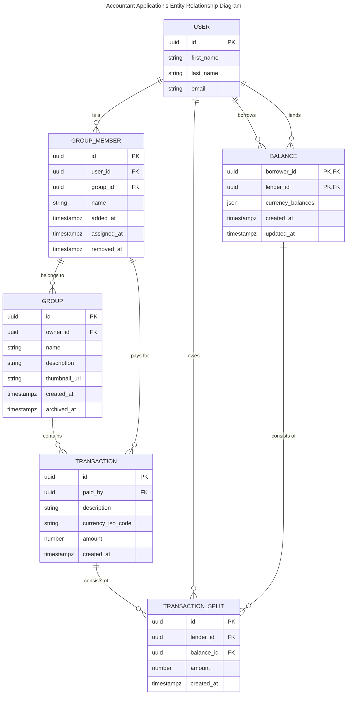

# Accountant

## Requirements

1. The system should allow users to create accounts and manage their profile information.
2. Users should be able to create groups and add other users to the groups.
3. Users should be able to add expenses within a group, specifying the amount, description, and participants.
4. The system should automatically split the expenses among the participants based on their share.
5. Users should be able to view their individual balances with other users and settle up the balances.
6. The system should support different split methods, such as equal split, percentage split, and exact amounts.
7. Users should be able to view their transaction history and group expenses.
8. The system should handle concurrent transactions and ensure data consistency.

## TODO

-   [*] Edit group members
-   [] Assign group member to a user
-   [*] Edit group without changing a photo
-   [] Summarized receivables
-   [] Translations
-   [*] Users spent amount by info
-   [] Transactions table pagination

## Entity Relationship Diagram



## PostgreSQL query

```sql
-- User table has already been created
-- Groups table
CREATE TABLE IF NOT EXISTS "group" (
    id UUID PRIMARY KEY,
    name VARCHAR(100) NOT NULL,
    description TEXT,
    created_at TIMESTAMPTZ NOT NULL DEFAULT NOW(),
    archived_at TIMESTAMPTZ
);

-- Group members table
CREATE TABLE IF NOT EXISTS group_member (
    id UUID PRIMARY KEY,
    user_id UUID REFERENCES "user"(id),
    name VARCHAR(100),
    group_id UUID NOT NULL REFERENCES "group"(id),
    added_at TIMESTAMPTZ NOT NULL DEFAULT NOW(),
    assigned_at TIMESTAMPTZ,
    removed_at TIMESTAMPTZ
);

-- Transactions table
CREATE TABLE IF NOT EXISTS "transaction" (
    id UUID PRIMARY KEY,
    paid_by UUID NOT NULL REFERENCES "user"(id),
    group_id UUID NOT NULL REFERENCES "group"(id),
    description TEXT,
    currency_iso_code CHAR(3) NOT NULL DEFAULT "PLN",
    amount NUMERIC(20, 2) NOT NULL,
    created_at TIMESTAMPTZ NOT NULL DEFAULT NOW()
);

-- Balances table
CREATE TABLE IF NOT EXISTS balance (
    id UUID PRIMARY KEY,
    borrower_id UUID NOT NULL REFERENCES "user"(id),
    lender_id UUID NOT NULL REFERENCES "user"(id),
    balances JSONB NOT NULL,
    created_at TIMESTAMPTZ NOT NULL DEFAULT NOW(),
    updated_at TIMESTAMPTZ NOT NULL DEFAULT NOW()
);

-- Transaction splits table
CREATE TABLE IF NOT EXISTS transaction_split (
    lender_id UUID NOT NULL REFERENCES "user"(id),
    balance_id UUID NOT NULL REFERENCES balance(id),
    transaction_id UUID NOT NULL REFERENCES "transaction"(id),
    amount NUMERIC(20, 2) NOT NULL,
    created_at TIMESTAMPTZ NOT NULL DEFAULT NOW()
);
```
